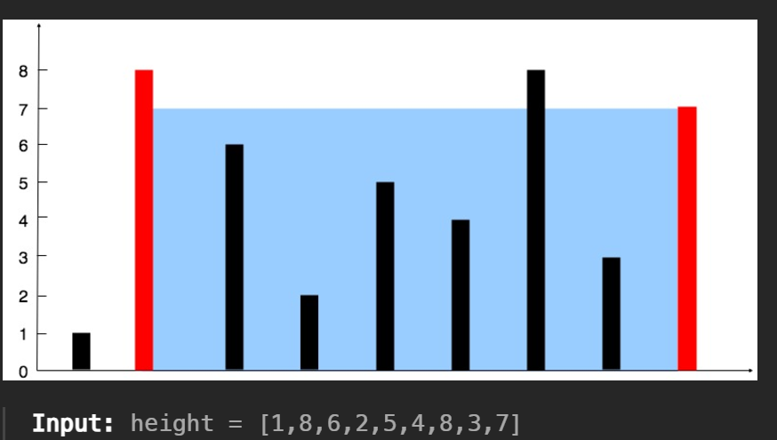

# 11. Container With Most Water

<https://leetcode.com/problems/container-with-most-water/>

給定數字陣列 `height`，找出能容納最多水容量的空間為多少  
要找出使用的是哪兩個 `heigth`，容器的容積等於 $min(h1, h2) \times (x2-x1)$

由於容器一定由左邊和右邊構成，所以可以使用雙指針，並且一個從左一個從右開始  
計算出當下的容積後，移動高度較低的指針，往中間靠近  
如此便能使用 $O(n)$ 找出最大的容積

## Takeaway

- Two Points
