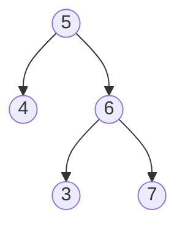

# 98. Validate Binary Search Tree

<https://leetcode.com/problems/validate-binary-search-tree/>

驗證所給定的樹是否為 BST  
並不能只是單純的檢查 `root.Val > root.Left.Val` 和 `root.Val < root.Right.Val` 後  
然後檢查 `root.Left` 和 `root.Right` 是否也符合這個特性

觀察其中節點 `6` 雖然符合 BST  
但 `root` 是 `5`，`3` 不應該被放在 `5` 的右側

## Takeaway

- Tree Traversal
- Binary Search Tree
