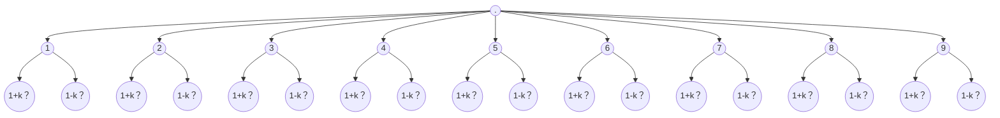

# 967. Numbers With Same Consecutive Differences

<https://leetcode.com/problems/numbers-with-same-consecutive-differences/>

須注意當 `k` 很小時，組合可能就會有很多種  
譬如若 `n=3, k=1`，則以 `1` 開頭的答案可能就會有 `121,123,101`

所以需要進行枚舉，這是一個 Backtracking 的題目  
因此需要先構思出樹的模樣

關於樹的橫向，除了開頭不能是 `0` 以外，之後的每位數皆可放置 `0`
每個節點都要探討 `+k` 和 `-k` 之後的節點是否存在（`0 <= +k/-k <= 9`）  
樹的深度取決於 `n`

## Takeaway

- Backtracking