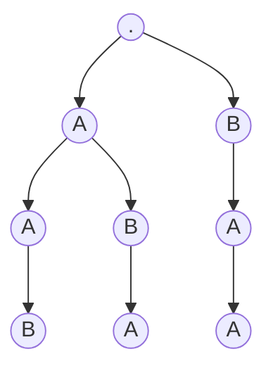

# 1079. Letter Tile Possibilities

<https://leetcode.com/problems/letter-tile-possibilities/>

枚舉即為 Backtracking 題目，需要能先構思出樹的模樣  
以 `AAB` 為例

由於題目是要求出 `"A", "B", "AA", "AB", "BA", "AAB", "ABA", "BAA"`  
所以這題並不是求出終點 leaf 的模樣，而是要計算整棵樹的節點數量（扣除 root）

## Takeaway

- Backtracking
